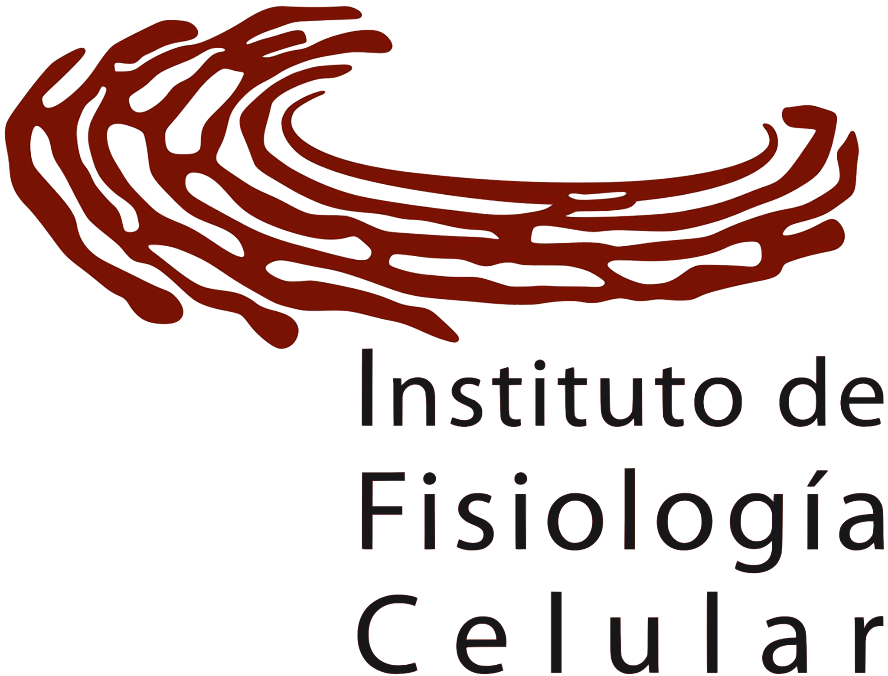
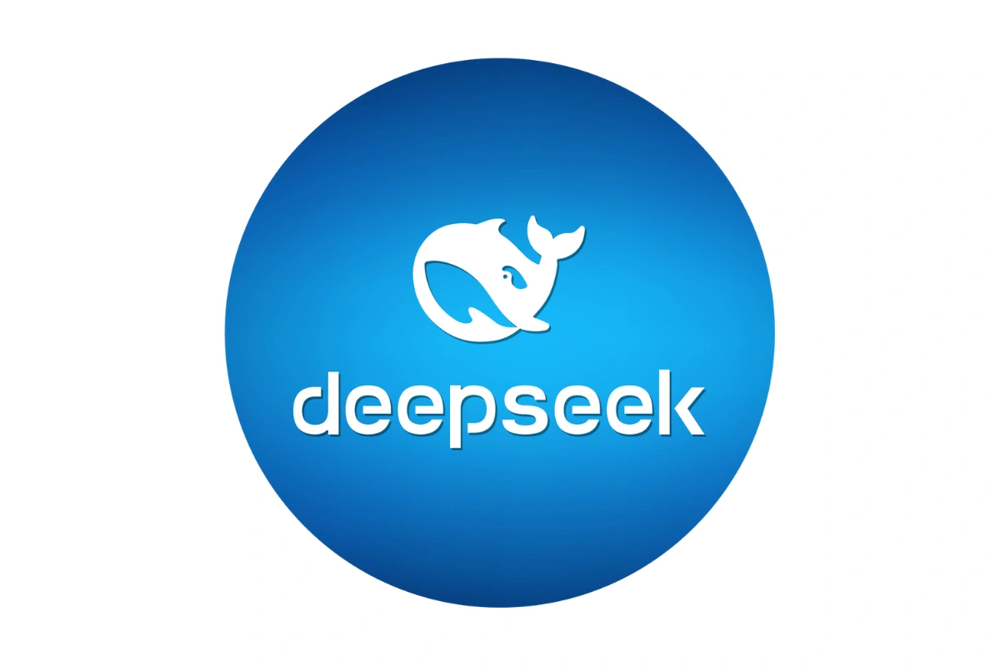
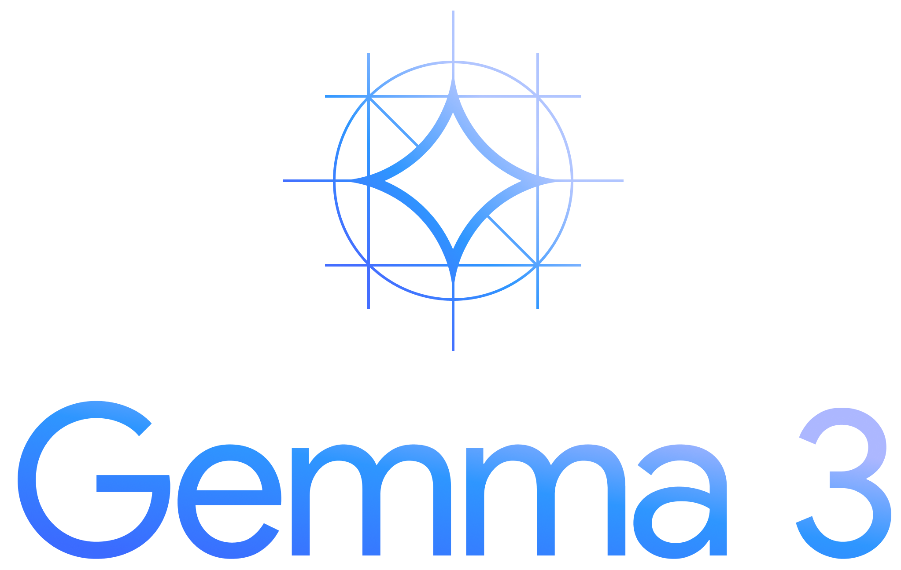

<!-- Logo IFC -->

<!-- Logo UBMI -->

 

## ¡Me lo dijo Chat!

 

### Una presentación sobre el uso de Modelos Grandes de Lenguaje (LLM) en nuestra comunidad. 

 

<a href="https://github.com/UBMI-IFC" target="_blank">
   <carbon:logo-github/>
</a>
<a href="mailto:ubmi@ifc.unam.mx" target="_blank">  <!-- class="slidev-icon-btn"> -->
   <carbon:email/>
</a>
<a href="https://sites.google.com/ifc.unam.mx/ubmi-ifc" target="_blank">  <!-- class="slidev-icon-btn"> -->
   <carbon:network-enterprise/>
</a>
<a href="https://www.youtube.com/@unidaddebioinformaticaifc5165" target="_blank">  <!-- class="slidev-icon-btn"> -->
   <carbon:logo-youtube/>
</a>

<!--  [Tutoriales UBMI-IFC](https://ubmi-ifc.github.io/Tutoriales-IFC) -->

---
layout: center
---

### Estudiantes de licenciatura y posgrado, _et al._:

 

<v-clicks>

# "Me lo dijo Chat..."

# "Hice lo que me dijo Chat..."

## "... pero no funcionó" 

</v-clicks>

&#128514;

---
layout: none
---

<svg width="600" height="165">
    <defs>
      <linearGradient id="rainbowGradient" x1="0%" y1="0%" x2="100%" y2="0%">
        <stop offset="0%" stop-color="red" />
        <stop offset="16%" stop-color="orange" />
        <stop offset="33%" stop-color="yellow" />
        <stop offset="50%" stop-color="green" />
        <stop offset="66%" stop-color="blue" />
        <stop offset="83%" stop-color="indigo" />
        <stop offset="100%" stop-color="violet" />
      </linearGradient>
      <path id="curve" d="M 50 200 Q 300 50 550 200" fill="transparent" />
    </defs>
    <text>
      <textPath href="#curve" startOffset="50%" text-anchor="middle">
        Mi amigo Chat
      </textPath>
    </text>
  </svg>

<figure>
  
  <figcaption>Creado con ChatGPT</figcaption>
</figure>  

---
layout: center
---

# Anécdota de la secundaria.

<figure>
    
    <figcaption>Creado con ChatGPT</figcaption>
</figure>

---
layout: center
---

# ¿La IA quitará empleos?

## "La IA (LLM) no te quitará tu trabajo, serán aquellas personas que saben usarla de forma eficiente."

Opinión informada

<!-- Richard Baldwin -->
<!-- https://en-m-wikipedia-org.translate.goog/wiki/Richard_Baldwin_(economist) -->

---
layout: section
---

# Es evidente que necesitamos hacer uso de esta tecnología.
## De forma racional y educada.

---
layout: two-cols-header
---

# La IA llegó para quedarse.

::left::

  
## Herramienta poderosa.

1. Apoyar para hacer investigación.

2. Automatizar tareas repetitivas y mejorar su eficiencia.

3. Ayudar en la toma de decisiones basada en datos.

4. Potenciar la personalización en servicios y productos.

5. Su uso está creciendo: [OpenAI dice](https://www.reuters.com/technology/artificial-intelligence/openai-says-chatgpts-weekly-users-have-grown-200-million-2024-08-29/)
  que ChatGPT tiene más de 200 millones de usuarios a la semana. 

::right::

## Es un NEGOCIO 

1. Las empresas tecnológicas buscan generar mejores productos.

2. Más eficientes, más útiles, más poderosos.

3. Muchas buscan tener el mejor producto.

<figure>
 
 <figcaption>Generado con Gemini</figcaption>
</figure>

---

# ChatGPT es un producto

<v-clicks>
  

    

      
    

    

      <h2>ChatGPT</h2>
      
Large Language Models

    

  

  

    

      
    

    

      <h2>Kleenex</h2>
      
Pañuelos desechables

    

  

  

    

      
    

    

      <h2>Pritt</h2>
      
Lapiz adhesivo

    

  

  
</v-clicks>  

---
layout: default
---

# Muchas empresas tecnológicas tienen sus propios modelos.

<figure>
  
  <figcaption style="font-size: small">Gemini/Gemma/Google</figcaption>
</figure>  

<figure>
  
  <figcaption style="font-size: small">Llama/Meta</figcaption>
</figure>  

<figure>
  
  <figcaption style="font-size: small">Qwen/Alibaba</figcaption>
</figure>  

<figure>
  
  <figcaption style="font-size: small">Copilot/Phi/Microsoft</figcaption>
</figure>  

<figure>
  
  <figcaption style="font-size: small">Deepseek/Deepseek</figcaption>
</figure>  

<figure>
  
  <figcaption style="font-size: small">ChatGPT/OpenAI</figcaption>
</figure>  

<figure>
  
  <figcaption style="font-size: small">Mistral/MistralAI</figcaption>
</figure>  

---
layout: center
---

# Muchos modelos tienen licencia de uso libre.
Se pueden usar de forma local y en combinación con muchas herramientas o programas diferentes.

Un ejemplo es Gemma3 de Google.

---

# Los LLM tienen un increible potencial para actividades de moral dudosa.

<v-switch> 
  <template #1></img></template>
  <template #2>

    
    </img>
    

    </template>
  <template #3>

    
    </img>
    

    </template>
</v-switch>

---
layout: section
---

# Es evidente que necesitamos hacer uso de esta tecnología.
## De forma racional y educada.

---

# Esfuerzos académicos para proponer un uso adecuado de los LLM (IA).

<v-switch>
  <template #1>
    

      </img>
      

  </template>
  <template #2>
    

      </img>
    

  </template>
</v-switch>

---
layout: image-right
image: ./recunam.png
---

# La UNAM también.

En 2023 la UNAM insala un [Grupo de trabajo sobre IA generatiba](https://www.gaceta.unam.mx/instalan-grupo-de-trabajo-sobre-la-inteligencia-artificial/).

El mismo año se publica una [guía de recomendaciones](https://iagenedu.unam.mx/recomendaciones?fbclid=IwY2xjawK1FRVleHRuA2FlbQIxMQABHnK0PzgUh9ckNxB7kTUqJV1CNTGRcq02hjXn9uiHhB5k9Eep69f43ZGKdNZO_aem_sRDDfBl7rpMnP9_EcybTNw&sfnsn=scwspwa)
para su uso en educación. 

---

# LLM en el Instituto de Fisiología Celular.

 

      

        
      

      

        <h3 >Taller Práctico. 2024.</h3 >
        
Uso ético de inteligencia Artificial para la Investigación. Principiante, intermedio y avanzado.
        <i>Alfredo Fernández</i>
        

      

    

  

      

        
      

      

        <h3 >Artículo publicado en Mensaje Bioquímico. 2024.</h3 >
        
ChatGPT: Un vistazo personal a esta inteligencia artificial. <i>Dr. Ruy Pérez Monfort</i>

      

    

  

      

        
      

      

        <h3 >UBMI</h3 >
        
Tenemos interés en el uso adecuado y desarrollo de herramientas con LLM.

      

    

---
layout: end
---

Gracias por su atención 

<figure>
<SlidevVideo v-after autoplay loop=true width=500>
  <!-- Anything that can go in an HTML video element. -->
  <source src="./Un_puma_antropomorfico_caricat.mp4" type="video/mp4" />
</SlidevVideo>
<figcaption>Generado con Veo2 (Google)</figcaption>
</figure>

